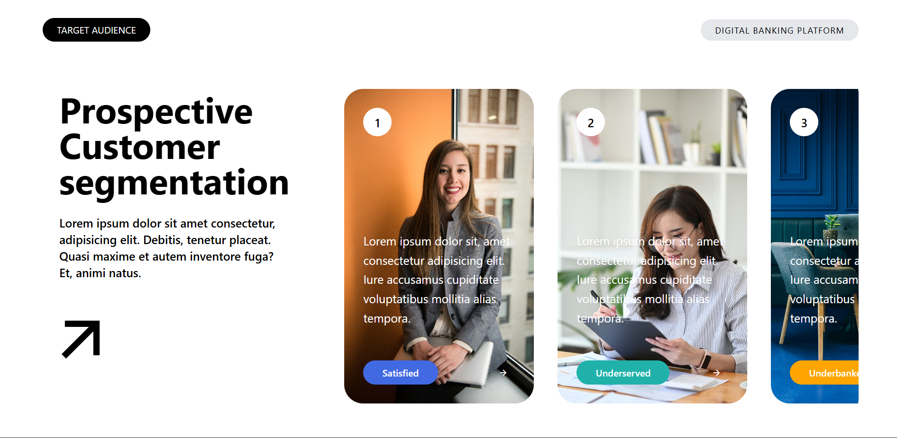

## Prospective Customer Segmentation UI
A sleek, responsive landing page section built with React and Tailwind CSS. This project was developed as a focused exercise in Component-Based Architecture and Prop-driven UI development.

## Preview

## 🚀 Project Overview
The goal of this project was to practice translating a high-fidelity design into a functional React application using Vite. The UI features a segmented customer view with scrollable cards, demonstrating clean layout techniques and modular code.

## Key Learning Objectives:
Component Modularity: Dividing the layout into reusable pieces (Navbar, Hero, Cards).

Props & Dynamic Data: Using React props to pass content into a single Card component to render multiple variations.

Tailwind CSS Mastery: Utilizing utility-first styling for layout, typography, and custom color overlays.

Responsive Design: Ensuring the "Target Audience" section remains intuitive across different screen sizes.

By Ankit Barmola